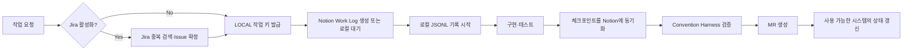

# C203 개발 하네스 가이드

이 문서는 C203 모노레포에 적용된 AI Agent Harness의 구조와 팀 작업 방법을 설명한다. 하네스의 목적은 AI와 사람이 같은 규칙으로 작업하고, 위험한 변경을 일찍 차단하며, Jira·Notion·GitLab에 작업 근거를 일관되게 남기는 것이다.

Jira 계층·Component·Release와 Flyway 세부 운영 규칙은 [Jira·Release·Flyway 운영안](jira-release-and-flyway.md)을 따른다.

## 1. 핵심 원칙

| 시스템 | Source of Truth | 저장하는 내용 |
| --- | --- | --- |
| Jira | 활성화 이후 작업 | 범위, 담당자, 상태, 완료 조건 |
| Notion | 지식과 과정 | 요구사항, 설계 결정, Work Log, Troubleshooting |
| GitLab | 코드와 검증 | Commit, MR, Pipeline, 배포 이력 |
| 로컬 JSONL | 작업 중 임시 원본 | 오류, 시도, 결정, 원인, 해결, 검증 |

현재는 Jira 프로젝트와 EC2가 아직 지급되지 않은 Bootstrap 단계다. 작업 중에는 `LOCAL-###` 키와 로컬 JSONL을 사용하고 의미 있는 체크포인트에서 Notion으로 동기화한다. Notion 연결 실패는 코드 검증을 무효화하지 않으며, 동기화 대기 상태로 남긴 뒤 재시도한다.



### 현재 허용 범위

- 허용: 하네스, 문서, React/Spring Boot 골격, 로컬 개발, 테스트, GitLab CI 검증·패키징
- 보류: EC2 SSH, 운영 환경변수 주입, 배포·Rollback Job, 실제 도메인·인증서 연결
- 활성화 조건: 지급 정보와 권한 확인, Secret 저장 위치 확정, 배포·Rollback 설계 검토, 사용자 승인

## 2. 저장소 구조

```text
project-root/
├── AGENTS.md                         공통 작업·보안·컨벤션 규칙
├── CLAUDE.md                         Claude 전용 진입 지침
├── frontend/AGENTS.md                React 작업 규칙
├── backend/AGENTS.md                 Spring Boot 작업 규칙
├── .agent/                           Jira·Notion 작업 데이터와 공통 워크플로
│   ├── workflow.md
│   ├── project.yml
│   ├── team-members.yml
│   ├── schemas/
│   ├── templates/
│   └── worklogs/*.jsonl
├── .agents/skills/                   작업 종류별 재사용 절차
├── .harness/                         Hook이 공유하는 안전 검사 구현
├── scripts/harness/                  작업 로그와 Convention 검증 명령
├── .claude/settings.json             Claude Hook 연결
├── .codex/{config.toml,hooks.json}   Codex MCP·Hook 연결
├── .githooks/                        commit/push 직전 검증
├── .gitlab-ci.yml                    서버 측 최종 품질 게이트
└── .gitlab/merge_request_templates/  MR 기록 형식
```

### `.agent`와 `.agents`의 차이

- `.agent/`: 프로젝트 상태와 작업 이력을 위한 데이터·템플릿·워크플로
- `.agents/skills/`: 특정 작업에서만 읽는 실행 절차

항상 읽어야 하는 짧은 규칙은 `AGENTS.md`에 두고, 긴 반복 절차는 Skill로 분리해 컨텍스트 사용량을 줄인다.

## 3. 최초 설정

Node.js 20.19 이상, Java 21, Python 3이 필요하다.

```powershell
npm install
npm --prefix frontend install
git config core.hooksPath .githooks
```

루트 `npm install`의 `prepare` 스크립트가 Git Hook 경로를 자동 설정하지만 다음 명령으로 확인할 수 있다.

```powershell
git config --get core.hooksPath
```

결과는 `.githooks`여야 한다. 이후 `sh scripts/harness/doctor.sh`(Windows: `powershell -ExecutionPolicy Bypass -File scripts/harness/doctor.ps1`)로 환경과 훅 동작을 진단한다. Claude/Codex의 프로젝트 Hook은 저장소를 신뢰한 상태에서 열었을 때만 동작할 수 있으므로 Git Hook과 GitLab CI를 최종 안전망으로 사용한다.

### GitLab 저장소 설정 (Maintainer 1회)

- `main`: Protected Branch — 직접 push 금지, MR로만 병합, 승인 1명 이상과 Pipeline 성공을 병합 조건으로 설정
- `dev`: 기본 브랜치로 지정. 소규모 직접 push는 루트 `AGENTS.md`의 예외 조건과 `dev-hotfix` Skill을 따른다
- Squash commits 기본 활성화, 병합 후 소스 브랜치 자동 삭제

### MCP 연결

`.codex/config.toml`(Codex)과 루트 `.mcp.json`(Claude)에는 상시 MCP로 Notion(요구사항·Work Log)만 선언돼 있다. Playwright(프런트 화면 4상태의 실제 브라우저 검증)는 프런트 작업 세션에서만 켠다 — MCP 도구 정의는 세션마다 토큰을 소모하므로 상시 선언은 최소로 유지한다. 그 밖의 MCP·플러그인은 개인 선택이며, 하네스와 충돌하면 하네스를 따른다. Atlassian MCP는 Jira 프로젝트와 접근 권한을 받은 뒤 주석을 해제하고 각 팀원이 자신의 계정으로 인증한다.

`.agent/project.yml`의 다음 값은 실제 DB가 준비된 뒤 채운다.

```yaml
notion:
  workLogsDataSource: "collection://..."
  troubleshootingDataSource: "collection://..."
```

OAuth Token과 Secret은 설정 파일이나 Work Log에 저장하지 않는다.

## 4. 작업 시작

### 4.1 작업 키 확정

Jira가 생성되기 전에는 충돌하지 않는 `LOCAL-###` 키를 순서대로 사용한다. 예: `LOCAL-001`, `LOCAL-002`.

Jira가 활성화된 후에는 제목, 도메인, 현재 Sprint의 열린 Issue를 검색한다. 동일 작업이 없을 때만 `.agent/templates/jira-feature.md` 또는 `jira-bug.md`로 Issue를 생성한다.

단순 설명, 코드 읽기, 짧은 질의에는 Issue를 만들지 않는다. 작업 중 별도 문제가 발견되면 사용자 승인 후 후속 Issue로 분리한다.

### 4.2 브랜치 생성

```text
<type>/<WORK_KEY>-<kebab-case>
```

예시:

```text
feat/ATH-123-paper-order
fix/ATH-241-websocket-reconnect
refactor/ATH-311-trading-domain
infra/ATH-401-gitlab-pipeline
chore/LOCAL-001-project-bootstrap
infra/LOCAL-002-ci-guard
```

모든 작업 브랜치는 최신 `dev`에서 분기한다. `main`과 `dev`에는 직접 push하지 않는다.

### 4.3 Work Log 시작

Notion Work Logs DB가 준비됐다면 `[WORK_KEY] 작업 제목` 페이지를 만든다. DB가 아직 없다면 로컬 로그부터 시작하고 Notion URL은 생략한다.

```powershell
python scripts/harness/task-log.py start LOCAL-001 "프로젝트 부트스트랩" `
  --domain platform `
  --work-type Chore `
  --owner "담당자" `
  --notion-url "Notion Work Log URL"
```

결과는 `.agent/worklogs/LOCAL-001.jsonl`에 append-only로 저장된다. 같은 작업 키의 기존 로그를 덮어쓰지 않는다.

## 5. 개발 중 체크포인트

다음 상황만 기록한다.

- 10분 이상 해결되지 않은 오류
- 같은 접근의 두 번 이상 실패
- 설계, 데이터 모델 또는 API 계약 변경
- 외부 API의 제한이나 비정상 동작
- 테스트·CI 실패
- 보안·성능·정합성 문제
- 임시 해결책과 기술 부채

```powershell
python scripts/harness/task-log.py checkpoint LOCAL-001 ERROR `
  "Redis Stream 메시지가 중복 소비됨" `
  --evidence "같은 eventId가 두 번 처리됨"

python scripts/harness/task-log.py checkpoint LOCAL-001 DECISION `
  "DB commit 이후 ACK 처리로 순서를 변경함" `
  --reason "commit 전에 ACK하면 장애 시 이벤트가 유실될 수 있음"
```

기록하지 않는 항목:

- 단순 오타나 즉시 해결된 import 오류
- 의미 없는 컴파일 오류 반복
- 최종 결과와 관계없는 대화
- Token, Secret, 개인정보, 인증 헤더, 전체 환경변수, DB 비밀번호

## 6. Skill 선택

| Skill | 사용하는 상황 |
| --- | --- |
| `backend-issue-workflow` | Spring Boot 기능·버그 작업 |
| `frontend-issue-workflow` | React 화면·상태·API 연동 작업 |
| `api-contract-sync` | Controller, DTO, API 경로 변경 |
| `db-migration` | Entity 또는 Schema 변경 |
| `troubleshooting-record` | 재사용 가치가 있는 장애·실패 기록 |
| `pr-check` | MR 생성 전 최종 점검 |
| `mr-review` | MR diff 리뷰와 코멘트 초안 작성 (PR-Agent 도입 전 대체) |
| `test-coverage` | 커버리지 게이트(LINE 80%·BRANCH 70%) 미달 시 테스트 보강 |
| `dev-hotfix` | dev 직접 push 예외 조건의 소규모 수정 |
| `improvement-backlog` | 범위 밖 개선 아이디어(인덱스·캐시·부하테스트 등) 기록 |
| `session-handoff` | 세션 종료·교대 시 인수인계 노트 작성과 이어받기 |
| `bug-hunt` | 원인 불명 버그의 재현·가설·회귀 테스트 절차 |
| `safe-refactor` | 동작 변경 없는 구조 개선 절차 |

작업에 필요한 Skill만 읽는다. Skill이 지정한 검증과 산출물은 루트 규칙보다 좁은 작업 절차로 적용한다.

### Skill 추가 절차

1. `.agents/skills/<kebab-name>/SKILL.md`를 만들고 frontmatter(`name`, `description`)를 작성한다.
2. 본문은 `먼저 읽을 근거 / 작업 순서 / 완료 기준 / 금지·승인` 골격을 따른다.
3. 이 문서의 Skill 표에 한 줄을 추가한다.
4. 팀원 1명의 MR 리뷰를 받아 병합한다. 개인 실험용 Skill은 저장소에 넣지 않는다.

## 7. 자동 검사 계층

| 시점 | 검사 |
| --- | --- |
| AI 도구 실행 전 | `.env`, 키 파일, 파괴적 Git·파일·DB·인프라 명령 차단 |
| AI 파일 수정 후 | 변경 파일의 하드코딩 Secret 검사 |
| AI 작업 종료 | 변경 영역 lint·단위 테스트 (빌드 제외) |
| pre-commit | Secret 파일, whitespace, 커밋 대상 검사 |
| commit-msg | Gitmoji + type 형식 검사 |
| pre-push | 브랜치 형식, Work Log, Secret 검사 (초 단위) |
| GitLab CI | Gitleaks, guard·컨벤션·Work Log 계약 회귀 테스트, 애플리케이션 테스트, 빌드 산출물 |

분 단위 검사(전체 test·build·커버리지)는 CI 한 곳에서만 강제해 로컬 반복 병목을 없앤다. MR을 열기 전에는 `verify-all`로 전체 검증을 1회 실행한다.

Hook이 실패하면 우회하지 않고 원인을 해결한다. 운영 설정·배포·DB migration 적용·CI credential·IAM/RBAC 변경은 사용자 승인이 필요하다.

## 8. 검증 명령

### 전체 검증

Windows:

```powershell
powershell -ExecutionPolicy Bypass -File scripts/harness/verify-all.ps1
```

Linux/macOS/Git Bash:

```bash
sh scripts/harness/verify-all.sh
```

### 개별 검증

```powershell
python scripts/harness/verify-worklog.py
npm --prefix frontend run lint
npm --prefix frontend run test
npm --prefix frontend run build
npm --prefix backend run test
npm --prefix backend run build
```

### 커버리지 게이트

```powershell
npm --prefix frontend run test:coverage
npm --prefix backend run test:coverage
```

기준: LINE 80%, BRANCH 70% (원본: `backend/build.gradle`, `frontend/vite.config.ts`, `.agent/project.yml`의 `quality`). 미달 시 `test-coverage` Skill을 따른다.

Windows 사용자 경로에 한글이 포함돼 Gradle Worker가 실패하는 경우에도 `npm --prefix backend ...` 명령은 ASCII 임시 드라이브를 자동 사용한다.

## 9. 작업 완료

검증을 마친 뒤 FINISH 이벤트를 추가한다.

```powershell
python scripts/harness/task-log.py finish LOCAL-001 "프로젝트 부트스트랩 완료" `
  --verification "frontend/backend test와 build 통과" `
  --mr-url "GitLab MR URL" `
  --notion-url "Notion Work Log URL"
```

완료 순서:

1. 전체 Harness 검증
2. 로컬 로그에 검증 결과와 남은 위험 기록
3. Notion Work Log를 `리뷰 중`으로 변경
4. 의미 있는 장애는 Troubleshooting DB에 별도 등록
5. Jira가 활성화된 경우에만 구현 요약, 테스트, MR, Notion 링크 기록
6. Jira가 아직 없다면 Jira 반영 대기 목록에 기록
7. 미해결 항목을 후속 Issue 후보로 분리

MR에는 `.gitlab/merge_request_templates/Default.md`를 사용한다. 코드·테스트·보안 실패는 병합을 차단하며, Notion 동기화 실패는 경고와 재시도 대상으로 처리한다.

## 10. Jira 활성화 전환

Jira 프로젝트를 지급받은 뒤 다음 순서로 전환한다.

1. 실제 프로젝트 URL, Project Key, Issue Type, Workflow와 팀 권한 확인
2. `.agent/project.yml`에서 `jira.status: active`, 실제 `projectKey`, `requireIssueKey: true` 설정
3. `.codex/config.toml`의 Atlassian MCP 설정 주석 해제 및 개인 인증
4. 기존 `LOCAL-###` Work Log를 대응 Jira Issue와 연결하고 Notion에 매핑 기록
5. 새 작업부터 Jira Key 브랜치와 Work Log 사용

기존 JSONL 파일은 이름을 바꾸거나 덮어쓰지 않는다. 예를 들어 `LOCAL-001 → ATH-12` 매핑은 Notion Work Log와 Jira 설명에 남긴다.

## 11. EC2 지급 후 전환

EC2가 지급되기 전까지 `.gitlab-ci.yml`은 guard, test, build까지만 실행한다. 배포 관련 값은 `.agent/project.yml`에서 비활성 상태를 유지한다.

EC2 지급 후에도 즉시 배포하지 않고 다음 항목을 먼저 확정한다.

- 인스턴스 OS·사양·리전과 재생성 정책
- Public IP/도메인/Cloudflare Tunnel 등 외부 접근 방식
- SSH 배포 계정, 최소 권한, Host Key 관리
- GitLab CI Variable과 Secret 저장 위치
- Docker Compose·Nginx·애플리케이션 포트
- `/actuator/health` 기반 Readiness·Smoke Check
- 실패 판정, 이전 이미지 보존과 Rollback 절차
- 로그·메트릭·디스크·백업 정책

승인 후 별도 `infra/<WORK_KEY>-...` 작업에서 배포 스크립트와 CI Job을 추가한다. Smoke와 Rollback 테스트가 끝난 뒤에만 아래 값을 활성화한다.

```yaml
infrastructure:
  ec2Status: ready
  deploymentEnabled: true

deployment:
  ciStageEnabled: true
```

PEM, SSH Private Key, 운영 `.env`는 저장소에 두지 않는다.

GitLab Release는 MR마다 만들지 않는다. EC2 배포가 활성화된 뒤 검증된 `main` Tag가 실제 배포에 성공했을 때만 생성한다. Jira Release는 그보다 앞선 계획·시연 단위로 사용할 수 있다.

## 12. 자주 발생하는 문제

### Work Log가 없다는 오류

브랜치의 작업 키와 파일명이 같은지 확인한다.

```text
브랜치: chore/LOCAL-001-project-bootstrap
로그:   .agent/worklogs/LOCAL-001.jsonl
```

### 브랜치 형식 오류

허용 type과 대문자 `LOCAL`/Jira Key, 소문자 kebab-case 설명을 사용한다.

### Secret 의심 오류

실제 값은 환경변수나 승인된 Secret 저장소로 옮긴다. `.env.example`에는 변수명과 설명만 작성한다. 검사 규칙 자체의 변경으로 인한 오탐이면 `.harness/secret-patterns.txt`를 단일 원본으로 수정하고 테스트한다.

### Notion 동기화 실패

로컬 JSONL을 삭제하거나 다시 만들지 않는다. 연결 권한과 Data Source ID를 확인한 뒤 마지막 체크포인트부터 재전송한다.

### 검증을 실행할 수 없음

성공으로 기록하지 않는다. 실행하지 못한 명령, 원인, 남은 위험을 Work Log와 MR에 명시한다.
